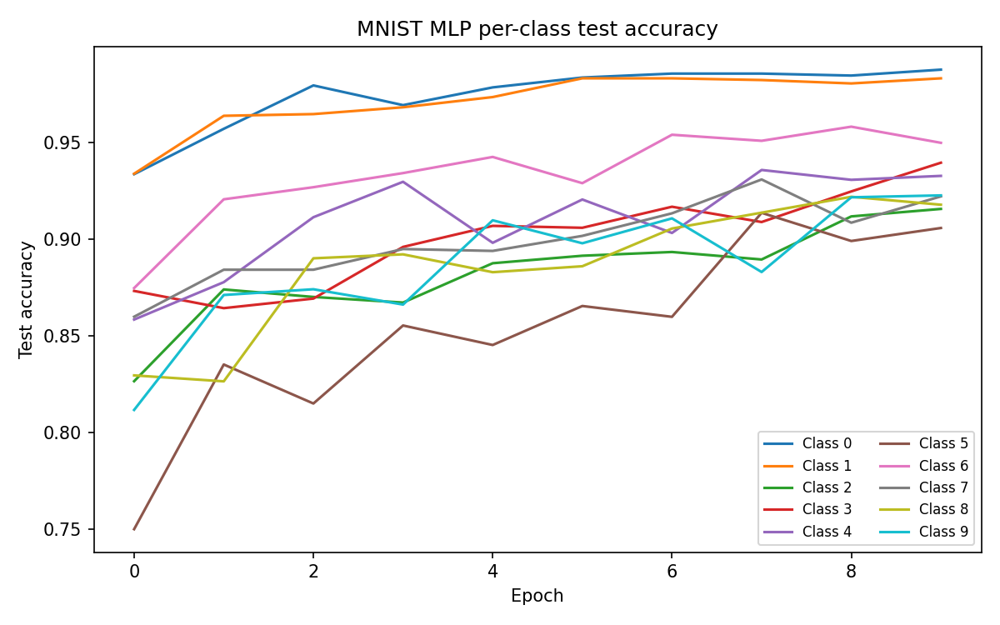

# Examples

## MNIST MLP

A 3-layer MLP trained end-to-end on MNIST:

```
Linear(784, 32) → ReLU → Linear(32, 32) → ReLU → Linear(32, 10)
```

optimized with `AdamW` and `CrossEntropyLoss` for 20 epochs (batch size 128, learning rate
0.0005). It evaluates train and test accuracy every epoch and writes `loss_history.csv` and
`per_class_accuracy.csv`.

```bash
./build/Release/mnist_mlp_example              # full training run
./build/Release/mnist_mlp_example 100          # cap to 100 samples (truncates BOTH train and test)
```

The MNIST CSVs are **not bundled** with the repo — only the conversion script
(`datasets/mnist/convert_to_csv.py`) is tracked; the downloaded parquet files and generated CSVs
are git-ignored. To produce them:

1. Download the MNIST splits from HuggingFace (`ylecun/mnist`) — the two parquet files
   `train-00000-of-00001.parquet` and `test-00000-of-00001.parquet`.
2. Place both parquet files in `datasets/mnist/` (next to `convert_to_csv.py`).
3. Install the Python dependencies: `pip install pandas pillow pyarrow`.
4. Run the converter from the repo root:

   ```bash
   python datasets/mnist/convert_to_csv.py
   ```

   The script reads the parquet files from its own directory and writes `mnist_train.csv` and
   `mnist_test.csv` into the same `datasets/mnist/` folder — a label column followed by 784 pixel
   columns, pixel values normalized to `[0, 1]`. The example reads those two CSVs.


The optional helper `python examples/mnist_mlp/plot_results.py` regenerates the plots from the
CSV files.

## MNIST CNN

A small CNN trained end-to-end on MNIST:

```
Conv2d(1, 8, kernel=3, stride=2, padding=1) → ReLU →
Conv2d(8, 16, kernel=3, stride=2, padding=1) → ReLU →
Flatten →
Linear(16*7*7, 10)
```

optimized with `AdamW` and `CrossEntropyLoss` for 10 epochs (batch size 128, learning rate
0.001). It evaluates train and test accuracy every epoch and writes `loss_history.csv` and
`per_class_accuracy.csv`.

```bash
./build/Release/mnist_cnn_example              # full training run
./build/Release/mnist_cnn_example 100          # cap to 100 samples (truncates BOTH train and test)
```

The MNIST CSV setup is identical to the MLP example above — see the MNIST MLP section for the
`convert_to_csv.py` instructions.



The optional helper `python examples/mnist_cnn/plot_results.py` regenerates the plots from the
CSV files.
