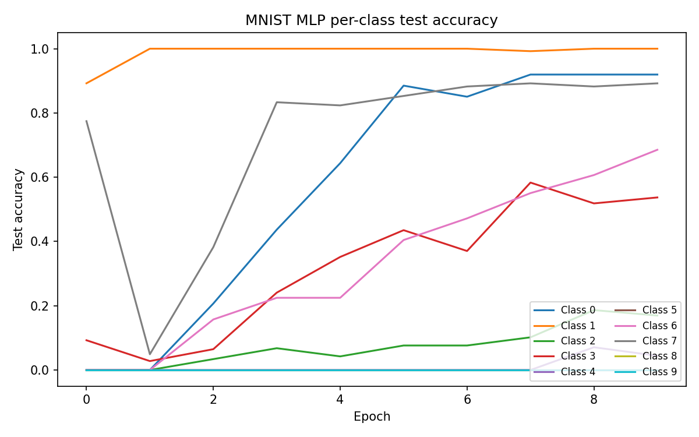

# torc

A minimal, from-scratch C++ tensor library. Naive `float32`-only storage with elementwise
operations and a tape-based autograd system, built on CMake with GoogleTest-based unit tests.

## Documentation

- **[AGENTS.md](AGENTS.md)** — orientation: project layout, build targets, conventions, known issues
- **[ROADMAP.md](ROADMAP.md)** — milestone checklist, what's done and what's next
- **[docs/DESIGN.md](docs/DESIGN.md)** — architecture decisions and the rationale behind them
- **[docs/AUTOGRAD.md](docs/AUTOGRAD.md)** — the autograd tape structure and backward algorithm
- **[docs/BENCHMARKS.md](docs/BENCHMARKS.md)** — CPU benchmark suite, including a PyTorch comparison

## Demonstration — MNIST MLP

The headline example is a 3-layer MLP trained end-to-end on MNIST:

```
Linear(784, 32) → ReLU → Linear(32, 32) → ReLU → Linear(32, 10)
```

optimized with `AdamW` and `CrossEntropyLoss` for 20 epochs (batch size 128, learning rate
0.0005). It evaluates train and test accuracy every epoch and writes `loss_history.csv` and
`per_class_accuracy.csv`.

```bash
./build/mnist_mlp_example              # full training run
./build/mnist_mlp_example 100          # cap to 100 samples (truncates BOTH train and test)
```

The MNIST CSVs are **not bundled** with the repo — the `datasets/` directory is git-ignored.
Download the data and place `mnist_train.csv` and `mnist_test.csv` (a label column followed by
784 pixel columns) under `datasets/mnist/`; for example, export the HuggingFace `ylecun/mnist`
parquet splits to CSV.



The optional helper `python examples/mnist_mlp/plot_results.py` regenerates the plots from the
CSV files.

## Features

### Tensor
- `torc::Tensor` with explicit-shape construction and initializer-list construction
- Elementwise `add`, `sub`, `mul`, `div` with NumPy-style broadcasting
- Scalar overloads for all four elementwise ops
- Unary negation (`operator-()`)
- Elementwise exponential (`exp()`)
- Elementwise natural logarithm (`log()`)
- Elementwise square root (`sqrt()`)
- Whole-tensor softmax (`softmax()`) with an axis-aware overload (`softmax(axis)`); the
  `nn::Softmax` module defaults to the last axis, while `CrossEntropyLoss` uses its own stable
  row-wise log-sum-exp implementation
- `operator==` for value + shape equality
- Pretty-printing (`operator<<`) for shape and data
- Raw pointer data access
- Shape inspection and element count
- Reductions: `sum()`, `mean()`, `max()`, `min()` (whole-tensor and axis-wise)
- `reshape()` / `view()` for changing shape — note this currently copies the underlying
  storage on every call (not a zero-cost stride trick); see `docs/AUTOGRAD.md`'s Common
  Pitfalls for why that matters if you're implementing backward for either
- Multi-dimensional indexing (`operator[](i, j, ...)`)
- `transpose()` for permuting dimensions
- Slicing (`slice()`) for contiguous-range sub-tensors (no arbitrary-index gather yet)
- `matmul()` for 2D and batched matrix multiplication with batch broadcasting

### Autograd
- `torc::Variable`: tape-based autograd wrapping `Tensor`, with `requires_grad`/`has_grad`
  tracking
- Backward pass via topological sort over the tape (not recursion) — see
  [docs/AUTOGRAD.md](docs/AUTOGRAD.md) for the full algorithm and why
- Ops are free functions (`torc::add(a, b)`, etc.), never `Variable` methods
- Implemented so far: scalar ops (`add_scalar`, `sub_scalar`, `mul_scalar`, `div_scalar`,
  `neg_scalar`), tensor-tensor elementwise ops with broadcasting backward (`add`, `sub`,
  `mul`, `div`, `neg`), reduction ops backward (`sum`, `mean`, whole-tensor and axis-wise),
  `max`/`min` backward with argmax tracking (whole-tensor and axis-wise), `matmul` backward
  (2D + batched, including batch-broadcast cases), view-op backward (`transpose`,
  `reshape`/`view`, `slice`), `detach()` / `set_grad_enabled(bool)`, unary
  transcendental ops (`exp`, `log`, `sqrt`) with backward and gradient checks, and guarded
  in-place ops (`Tensor::fill` / `Variable::fill` throws `TorcError` on tracked
  Variables) — each with gradient checks against central finite differences where applicable
- **Known constraint:** the tape holds raw, non-owning pointers to the `Variable`s in a graph,
  paired with weak lifetime tokens. Backward detects destroyed tracked ancestors and throws
  `TorcError`, but does not keep them alive; every tracked `Variable` must still outlive
  `backward()` on any of that graph's outputs. See `docs/DESIGN.md`.

### Milestone 5 - Basic ML (in progress)
- `nn::Module` base class with `forward()` hook and parameter registration
- `nn::Sequential` container for chaining modules
- `nn::Linear` layer with weight/bias parameters and autograd support
- Activation modules: `nn::ReLU`, `nn::Sigmoid`, `nn::Softmax`
- Loss functions: `nn::MSELoss`, `nn::CrossEntropyLoss`
- Optimizers: `optim::SGD` with momentum, `optim::Adam`, `optim::AdamW`
- Data loaders: `data::TensorDataset`, `data::SyntheticRegression`, `data::CSVDataset`, `data::MNISTDataset`, and `data::DataLoader` with batching and shuffling
- End-to-end example: MNIST MLP (`examples/mnist_mlp/mnist_mlp.cpp`)

## Benchmark (vs PyTorch)

`torc` is a naive, single-threaded, `float32`-only implementation — it is not meant to compete
with production frameworks. The table below places it side-by-side with PyTorch (CPU,
single-threaded) on the same machine and Release builds, so you can see where the naive path
stands.

| Operation | Shape | torc (µs) | torch 2.11 (µs) | torc / torch |
|-----------|-------|-----------|-----------------|--------------|
| Elementwise add | [16384] | 6.6 | 9.3 | 0.7× |
| Matmul 2D | [64, 64, 64] | 64.5 | 19.7 | 3.3× |
| Matmul 2D | [128, 128, 128] | 512 | 99.3 | 5.2× |
| Matmul 2D | [256, 256, 256] | 4283 | 869 | 4.9× |
| Batched matmul | [4, 64, 64, 64] | 261 | 74.1 | 3.5× |
| Batched matmul | [8, 128, 128, 128] | 4142 | 1069 | 3.9× |
| Softmax | [16384] | 265 | 39.8 | 6.7× |
| Transpose 2D | [256, 256] | 424 | 4.4 | 96× |

Measured single-threaded on the same reference machine, Release builds. `torc` numbers come from
Google Benchmark (`-DBUILD_BENCHMARKS=ON`); torch numbers from `benchmarks/bench_torch.py`
(`torch.set_num_threads(1)`). Full tables and methodology are in
**[docs/BENCHMARKS.md](docs/BENCHMARKS.md)**.

How to read it: elementwise ops are already competitive — `torc`'s `simd` fast path beats eager
PyTorch dispatch at this size — while `matmul` trails by ~3–5× and `softmax`/`transpose` by more.
The `transpose` gap is the most telling: `torch.t()` is a zero-copy view, whereas `torc` still
copies storage on every `transpose`/`reshape`/`view` (see `docs/DESIGN.md`'s memory-model notes
and the project's known issues).

## Requirements

- CMake 3.16+
- A C++23 compiler (GCC, Clang, or MSVC)
- Git (for fetching GoogleTest / Google Benchmark during the build)
- Optional: OpenMP (enable with `-DUSE_OPENMP=ON` for parallelized elementwise/reduction ops)

## Build

```bash
cmake -S . -B build
cmake --build build --config Release
```

For benchmarks (includes the `torc_benchmarks` target):

```bash
cmake -S . -B build -DBUILD_BENCHMARKS=ON
cmake --build build --config Release
```

## Run tests

```bash
ctest --test-dir build --output-on-failure -C Release
```

Tests use [GoogleTest](https://github.com/google/googletest), fetched automatically via CMake
`FetchContent`. The `TorcTests` target covers `tests/test_tensor.cpp` (Tensor),
`tests/test_autograd.cpp` (Variable / autograd), `tests/test_nn.cpp` (`nn::Module` /
`nn::Sequential`), and `tests/test_data.cpp` (`data::TensorDataset` / `data::DataLoader`).

## License

Distributed under the MIT License. See [LICENSE](LICENSE) for details.
